# Introduction

In this challenge, you will build an Action for the Google Assistant which will allow you to deploy infrastructure resources to the Google Cloud Platform (GCP) using your voice. In a nutshell, the Action will make an HTTP request to a Cloud Run service, which will deploy infrastructure resources using Deployment Manager. See the architecture diagram below.

PS: Note that this tutorial was written on August 2019, so depending on when you're reading this, the Google Cloud console and the DialogFlow console might look different - but the steps to be performed will likely be the same.

# Architecture

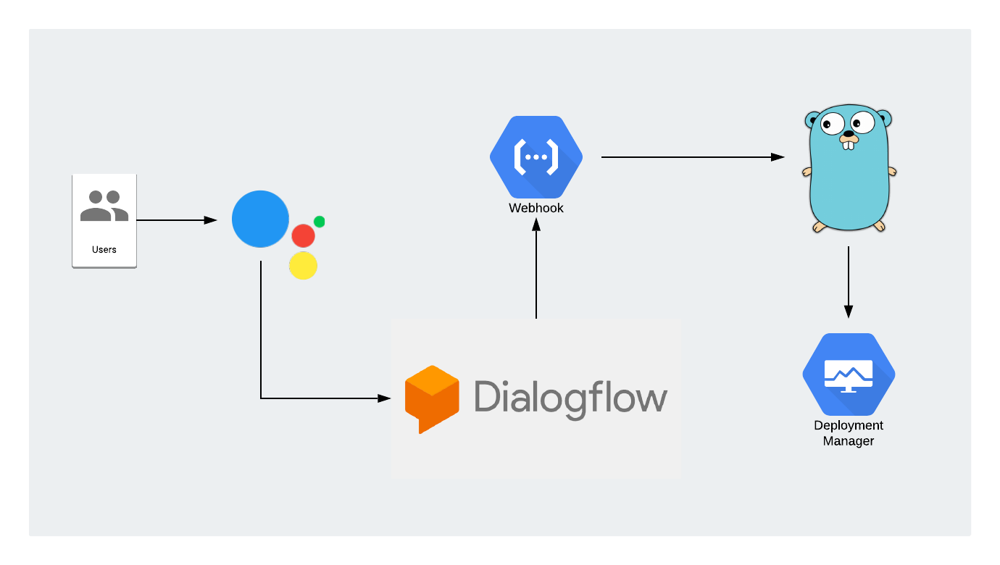

Here's the workflow of the final solution:

* A user will invoke an Action on the Google Assistant and will say a sentence;
* The sentence will be sent to a DialogFlow agent;
* The agent will be invoked by triggering a Webhook function;
* The Webhook function will then make an HTTP request to a Golang application running on Cloud Run;
* The Golang application running on Cloud Run will use a Shell script to launch resources on GCP using Deployment Manager

Let's start by creating a Google account. If you already have one, go to the [Setting up your Google Cloud account](#setting-up-your-google-cloud-account) section.

# Creating a Google Cloud account

In order to create a Google Cloud account, you will first need a Google account. If you do not have a Google account, [follow these steps](https://support.google.com/accounts/answer/27441?hl=en).

If you do have a google account, head over to the [Google Cloud Console](https://console.cloud.google.com/). If you've never used Google Cloud with your email, you will be asked to input some information to enable billing (section [Enabling Billing in your Google Cloud account](#enabling-billing-in-your-google-cloud-account) will explain that in details). If you have already enabled billing, head over to the [Setting up your Google Cloud account](#setting-up-your-google-cloud-account) section.

# Enabling Billing in your Google Cloud account

When you go to the console, you will be greeted with the following pop-up window:

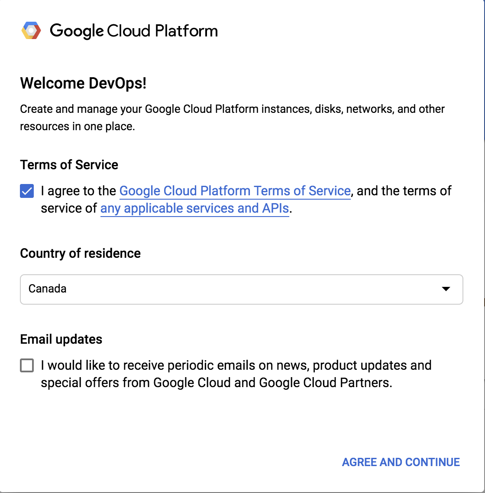

Click on **Agree and Continue**. The good thing about new GCP accounts is that Google gives you $300 of credit to use for 12 months (free trial):


However, in order to do that, you will have to create a billing account, which means providing your credit card. **Google will not charge your credit card when you spend all $300. You will have to manually upgrade your account to a paid one so you start paying for resources.**

To create a billing account, click on the menu icon on the top left, and then **Billing**:

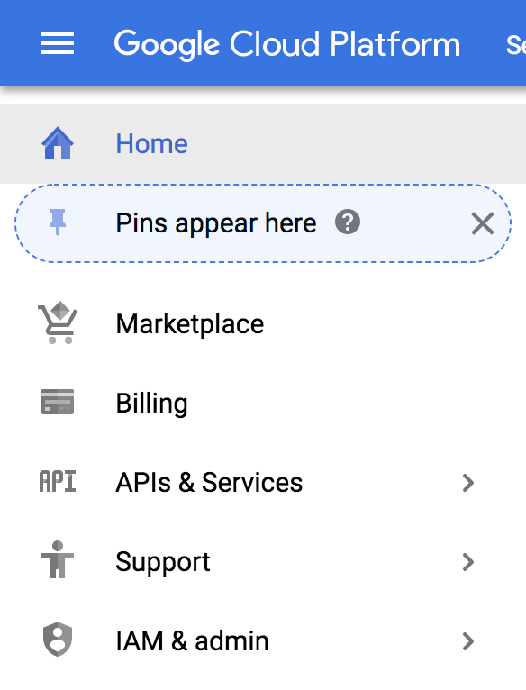

Click on **Add billing account**:

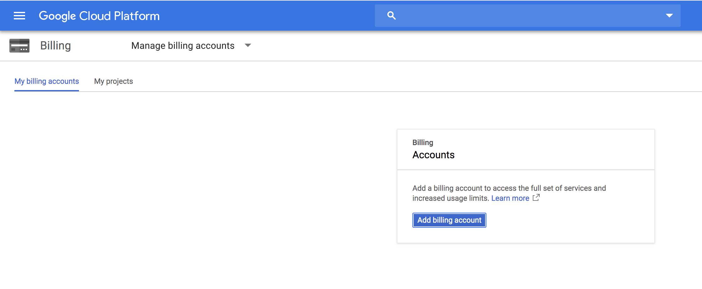

Follow the steps. Choose the account type (individual), provide your name, address and credit card information and click on **Start My Free Trial**. 

Now that billing has been enabled, let's set up the account for this challenge.

# Setting up your Google Cloud account

## Create a Project

As a first step, we will need to create a Project to host all infrastructure resources that will be deployed. Go to the [Manage Resources page](https://console.cloud.google.com/cloud-resource-manager) and click on **Create Project**. Set the project name to `deployment-manager-dojo` (you can choose any name you want, but in this documentation the Project will be referred to as `deployment-manager-dojo`). Note that right below **Project Name** there's **Project ID**. The project ID is a globally unique identifier for the project, which means you need to choose a Project ID that no one else in any other Google CLoud account has chosen. If you don't pick one, Google will assign it a random name and you have the option to change it by clicking the **EDIT** button. Once you're ready, click **Create**.

After a few seconds, the project will be created. Click on **Google Cloud Platform** at the blue bar at the top:


Check if your project has been automatically selected:


If it hasn't, click on the drop down and select your newly created project.

## Enabling APIs

On GCP, if you want to use a service (an API), you need to first enable it. [Follow this page](https://support.google.com/googleapi/answer/6158841?hl=en) and enable the following APIs:

* Google Container Registry
* Cloud Run API
* Kubernetes Engine API
* Cloud Build API
* Cloud SQL Admin API
* Cloud Resource Manager API

We are finally ready to start the challenge! Let's start by deploying the Cloud Run service that will be responsible for provisioning resources on GCP.

# Deploying the Cloud Run service

## The Cloud Shell

In order to deploy the service, you'd need to first install the Googl Cloud SDK. However, instead of providing instructions to install the Google Cloud SDK for each system (Linux, Mac and Windows), let's take an easier approach. Google Cloud provides a shell called [Cloud Shell](https://cloud.google.com/shell/docs/). To quote the [documentation](https://cloud.google.com/shell/docs/features), "Google Cloud Shell is an interactive shell environment for Google Cloud Platform. It makes it easy for you to manage your projects and resources without having to install the Google Cloud SDK and other tools on your system". 

To active Cloud Shell, click on the *terminal* icon at the blue bar:


This will bring up a shell on the same page:

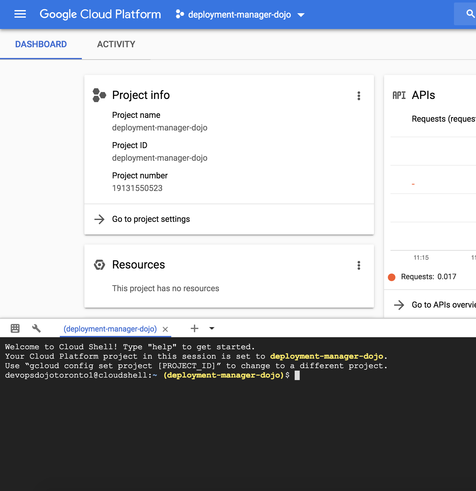

If you'd like a bigger terminal, click on the second to last icon to **Open in new window**.

To test if your configuration is correct in the terminal, type in:

```
$ gcloud config list
[component_manager]
disable_update_check = True
[compute]
gce_metadata_read_timeout_sec = 5
[core]
account = <your-email>
disable_usage_reporting = False
project = <your-project>
[metrics]
environment = devshell
Your active configuration is: [cloudshell-15535]
```

If you do not see your project name, that means you did not select the project in the console. To configure the SDK to point at your project, run `gcloud config set core/project <your-project-name>`.

**PAY ATTENTION!**

*When you start Cloud Shell, it provisions a g1-small Google Compute Engine virtual machine running a Debian-based Linux operating system. Cloud Shell instances are provisioned on a per-user, per-session basis. The instance persists while your Cloud Shell session is active and terminates after an hour of inactivity.*

Since we cannot rely entirely on this shell to persist data, we will not be developing on it. We will only use it to deploy a service which has already been developed.

Now, let's clone the repository where the code for the Cloud Run service is.

## Clone the Deployment Manager repository

Still in the Cloud Shell, clone the following repository: [https://github.com/slalomdojo/deployment-manager.git](https://github.com/slalomdojo/deployment-manager.git)

Once the repository has been cloned, cd into it. Instead of using Docker to build and push a container image, we will be using Google's Cloud Build service to do so. [Follow this page](https://cloud.google.com/run/docs/quickstarts/build-and-deploy) to learn how to build container images with Cloud Build. One thing to be careful with is how you will name your image. **Because Cloud Build will automatically push the image, you need to use the Container Registry domain, followed by the Project ID and a name. Use the following: gcr.io/(PROJECT-ID)/deployment-manager**.

If everything worked as expected (build and push), go to the Container Registry console and you should see the following:

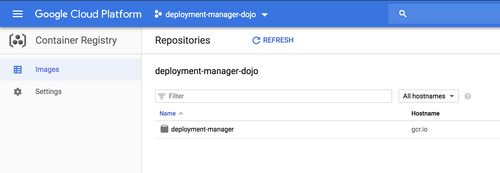

Next step will be to deploy this Docker image to Cloud Run. To do that, you should use the `gcloud` command in the Cloud Shell. Do a quick research to find out which command you should use. 

Here's the information you will need:

* Region: `us-central1`
* Service name: `deployment-manager`
* Image: `gcr.io/<PROJECT-ID>/deployment-manager`
* Target **platform**: `managed`
* Allow unauthenticated invocations to [deployment-manager]: `y` (Do not leave this application unprotected. We're just allowing unauthenticated invocations to make things simpler for this challenge).

Go to the Cloud Run console and you should see the following:

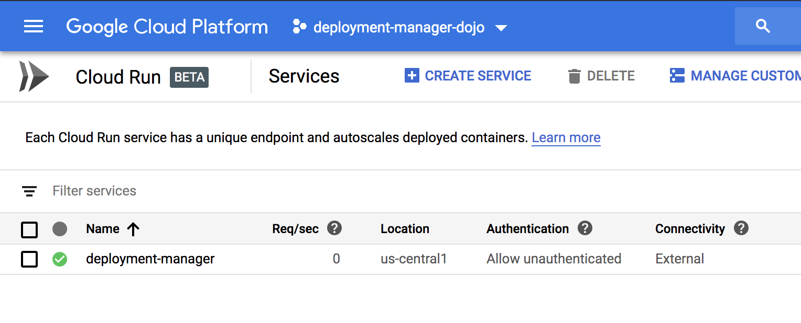

Now click on **deployment-manager**, then at the top you should see an **URL**. Click on that URL or copy and paste to your browser. After a few seconds, you should see the message:

```
You successfully deployed this application to Cloud Run! Now let the fun begin!
```

# Getting familiar with DialogFlow terminology

Before you move on to DialogFlow, we strongly suggest you read the definitions below and discuss that with the organizers in case you have any question. It is very important that you understand all these concepts. The sections below are just a summary. If you want to read the full documentation, [click on this link](https://cloud.google.com/dialogflow/docs/concepts).

## Agents

A Dialogflow agent is a virtual agent that handles conversations with your end-users. It is a natural language understanding module that understands the nuances of human language. Dialogflow translates end-user text or audio during a conversation to structured data that your apps and services can understand. You design and build a Dialogflow agent to handle the types of conversations required for your system.

A Dialogflow agent is similar to a human call center agent. You train them both to handle expected conversation scenarios, and your training does not need to be overly explicit.


## Intent

An intent categorizes an end-user's intention for one conversation turn. For each agent, you define many intents, where your combined intents can handle a complete conversation. When an end-user writes or says something, referred to as an end-user expression, Dialogflow matches the end-user expression to the best intent in your agent. Matching an intent is also known as intent classification.

## Entity

Each intent parameter has a type, called the entity type, which dictates exactly how data from an end-user expression is extracted.

Dialogflow provides predefined system entities that can match many common types of data. For example, there are system entities for matching dates, times, colors, email addresses, and so on. You can also create your own developer entities for matching custom data. For example, you could define a vegetable entity that can match the types of vegetables available for purchase with a grocery store agent.

## Fulfillment

If you are using one of the integrations options, and your agent needs more than static intent responses, you need to use fulfillment to connect your service to your agent. Connecting your service allows you to take actions based on end-user expressions and send dynamic responses back to the end-user. For example, if an end-user wants to schedule a haircut on Friday, your service can check your database and respond to the end-user with availability information for Friday.

Each intent has a setting to enable fulfillment. If an intent requires some action by your system or a dynamic response, you should enable fulfillment for the intent. If an intent without fulfillment enabled is matched, Dialogflow uses the static response you defined for the intent.

When an intent with fulfillment enabled is matched, Dialogflow sends a request to your webhook service with information about the matched intent. Your system can perform any required actions and respond to Dialogflow with information for how to proceed

# Creating a DialogFlow agent

First, head over to the [DialogFlow console](https://console.dialogflow.com/) and click **Sign in with Google**. Choose your account and click **Allow** so DialogFlow can access your Google account. Next, in the *review account settings* page, select Canada as your country, tick the box where it says **Yes, I have read and accept the agreement.** and click **Accept**.

Once you are in the DialogFlow page, you should see the follow:

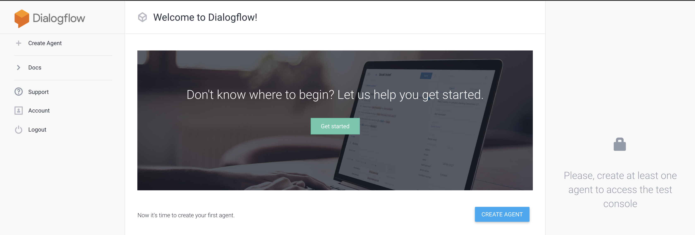

Now, let's create an agent which will be responsible for handling conversations with you. Click on **Create Agent**. Use the follow information:


PS: your GCP project name will be different than what you see in the image. Select your project.

After creating the agent, you should see the following page:

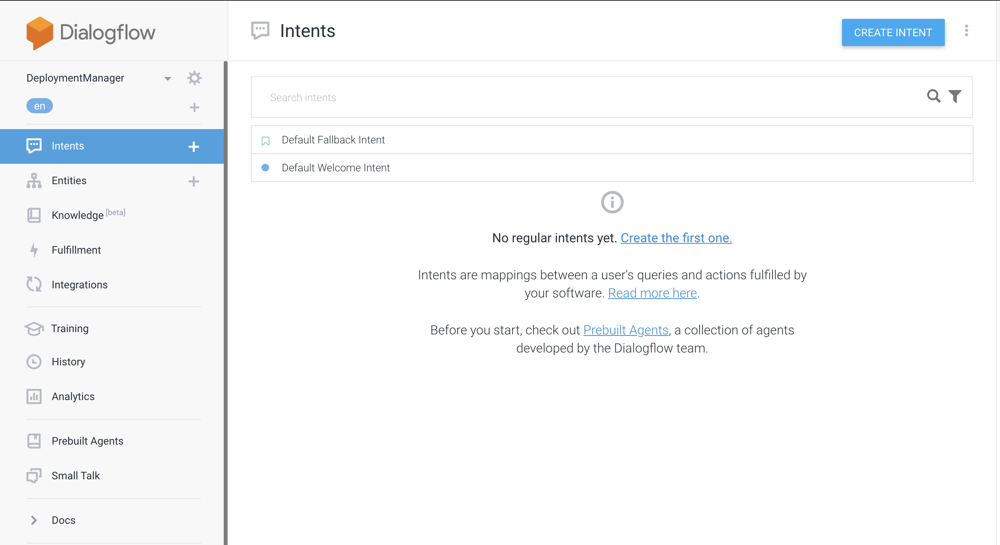

Note that two Intents were already created for you: **Default Fallback Intent** and **Default Welcome Intent**. Basically, the Welcome Intent matches user phrases such as "Hello!", "Hi there!" with static responses such as "Hi! How are you?". The Fallback Intent, on the other hand, is matched whenever a user phrase is not matched with any other Intent. In that case, the Google Assistant will say things like "I didn't get that. Can you say it again?"

Should we try it?!

We will not be talking to the Google Assistant in our phones just yet as it hasn't been configured. Back to the DialogFlow console, you will see on the right-hand side a panel where at the top it says **Try it now** (that's the Google Assistant simulator):


So type in: *hello*. You should get back:


Let's go over all this information. First, it shows what the user said (in the **User says** field): `hello`. Then, one of the default responses. In my case I got `Hello! How can I help you?`, but you might've got the same or a different response. And finally, you can see the Intent matched: `Default Welcome Intent` (don't worry about `Action`).

Now, to test the Default Fallback Intent, type in `1234test`.

# Creating a Deploy Intent

Let's create out first intent: Deploy. This Intent will match user phrases that request deployment of Cloud resources without specifying the resources. For example, "Hey Google, ask Deployment Manager for an environment". 

First, go back to the list of Intents and click on **Create Intent**. Call it **Deploy**. You will see that there are quite a few things that can be configured: Contexts, Events, Training Phrases, Action and parameters, Responses and Fulfillment. We're only going to configure Training Phrases and Fulfillment.

Click on **Add Training Phrases**. Now, what you're going to do is to add as many phrases as possible so the agent can be trained properly. Remember that the user should ask for a deployment or environment without specifying details of the infrastructure to be deployed. So use phrases like:

* I would like an environment
* I want a test bed
* Deploy infrastructure resources

Be creative!

Next, click on the Fulfillment section, the **enable fulfillment** and **Enable webhook calls for this intent** (do not worry about Enable webhook call for slot filling). What's going to happen now is that whenever the user says a phrase that matches this intent, a Node.js function will be executed. We will see how that works in just a second. Make sure you save your intent configuration by clicking **Save** at the top.

# Fulfillment

On the left-hand side, click on **Fulfillment**. Fulfillment will give you two options:

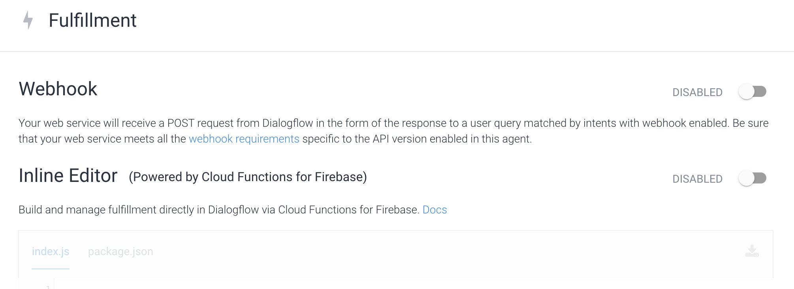

The difference is that if you select Webhook, you will have to deploy a Cloud Function and manage that function yourself. If you choose Inline Editor, Google will see that your function is deployed and maintained. For the purpose of this Dojo, let's use the Inline Editor to make things simpler. Enable the Inline Editor.

PS: If you get this error:


Just wait a little bit and refresh the page.

After enabling the Inline Editor, you should see a bit of Javascript code. **DELETE ALL THE CODE AND PASTE THE FOLLOWING**

`index.js`
```
'use strict';
 
const functions = require('firebase-functions');
const {WebhookClient} = require('dialogflow-fulfillment');
const {Card, Suggestion} = require('dialogflow-fulfillment');
 
process.env.DEBUG = 'dialogflow:debug'; // enables lib debugging statements
 
exports.dialogflowFirebaseFulfillment = functions.https.onRequest((request, response) => {
  const agent = new WebhookClient({ request, response });
  console.log('Dialogflow Request headers: ' + JSON.stringify(request.headers));
  console.log('Dialogflow Request body: ' + JSON.stringify(request.body));

  function welcome(agent) {
    agent.add(`Welcome to my agent!`);
  }
 
  function fallback(agent) {
    agent.add(`I didn't understand`);
    agent.add(`I'm sorry, can you try again?`);
  }

  function googleAssistantHandler(agent) {
    let conv = agent.conv(); // Get Actions on Google library conv instance
    conv.ask('Ok. I can deploy a few things, but I will tell you all about it soon.'); // Use Actions on Google library
    agent.add(conv); // Add Actions on Google library responses to your agent's response
  }

  // Run the proper function handler based on the matched Dialogflow intent name
  let intentMap = new Map();
  intentMap.set('Default Welcome Intent', welcome);
  intentMap.set('Default Fallback Intent', fallback);
  intentMap.set('Deploy', googleAssistantHandler);
  agent.handleRequest(intentMap);
});
```

Also, select the `package.json` tab, **DELETE ALL THE CODE AND PASTE THE FOLLOWING**

`package.json`
```
{
  "name": "dialogflowFirebaseFulfillment",
  "description": "This is the default fulfillment for a Dialogflow agents using Cloud Functions for Firebase",
  "version": "0.0.1",
  "private": true,
  "license": "Apache Version 2.0",
  "author": "Google Inc.",
  "engines": {
    "node": "8"
  },
  "scripts": {
    "start": "firebase serve --only functions:dialogflowFirebaseFulfillment",
    "deploy": "firebase deploy --only functions:dialogflowFirebaseFulfillment"
  },
  "dependencies": {
    "actions-on-google": "^2.5.0",
    "dialogflow": "^4.0.3",
    "dialogflow-fulfillment": "^0.6.1",
    "firebase-admin": "^6.4.0",
    "firebase-functions": "^2.1.0"
  }
}
```

*Deploy* the Fulfillment (it might take a minute or more). Once the deployment finishes, we will have to configure the Google Assistant (if you use the in-built Google Assistant on the right-hand side of the page to test the Deploy intent, it will not work - the request needs to come from the real Google Assistant).

# Setting up the Google Assistant Integration

In the DialogFlow console, click on Integrations:

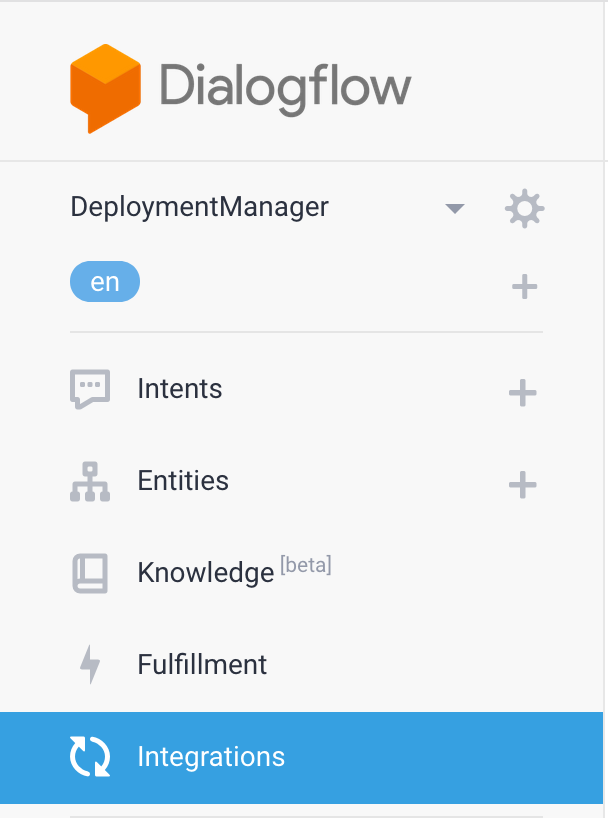

Now click on the Google Assistant Integration. You should see this pop-up window:

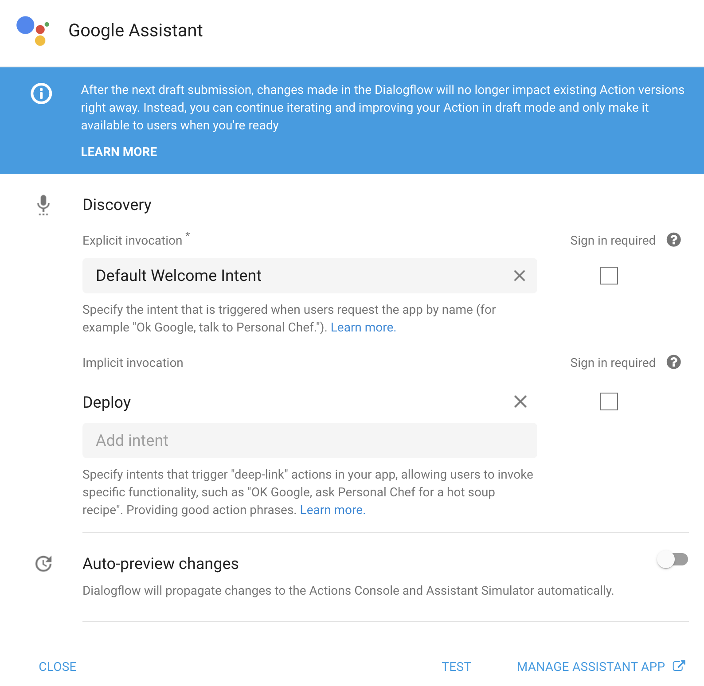

You notice that the Explicit Invocation is set to be the Default Welcome Intent. Now, you need to set up the Implicit Invocation just like the image above. Type in *Deploy* in the *Add Intent* text field. Next, click on **Test**.

You will be taken to the Actions on Google page. Accept their Terms of Service, select Canada as your country, opt in or not for updates and click on **Agree and Continue**. You should land on this page:

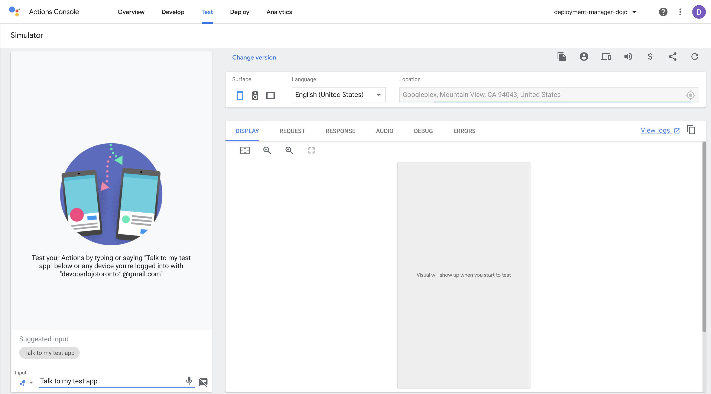

Before using the simulator, click on **Overview** at the top to open the configurations page:

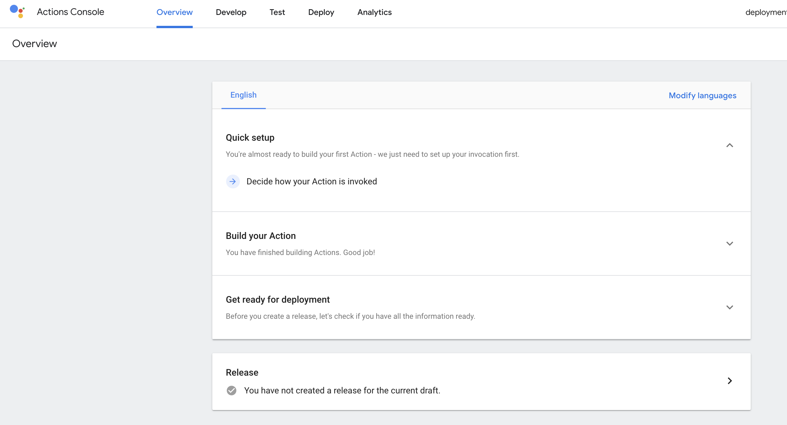

In this page, we will configure two things:

* How our Action will be invoked
* What kind of voice the Google Assistant will use with our Actions

In *Quick Setup*, click on **Decide how your Action is invoked**. Then, choose a unique name for your Action (e.g. **Super Deployment Manager**) and the Google Assistant voice. If you get a message saying the name you chose is already being used by another Action, choose another name. For this challenge, I've used Super Deployment Manager, but replace that name with yours. Finally, click on **Save**.

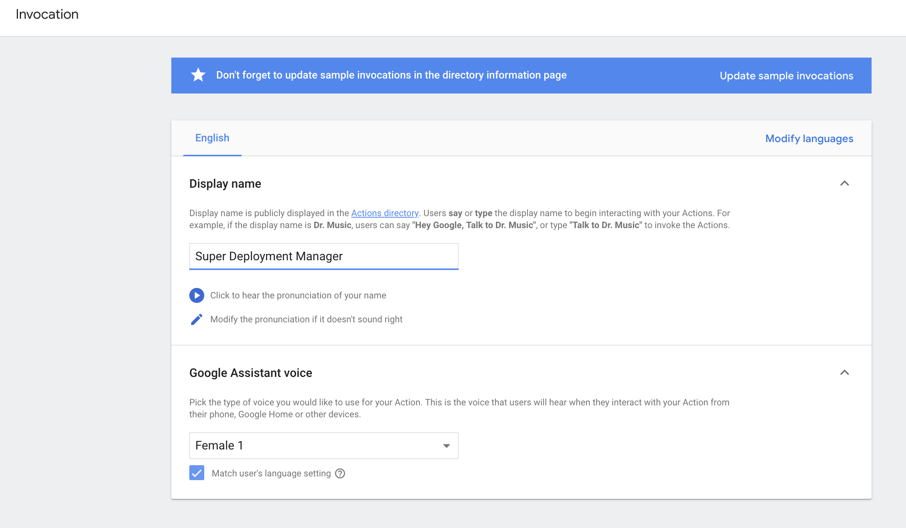

Now we're ready to use the simulator. Click on **Test** at the top:

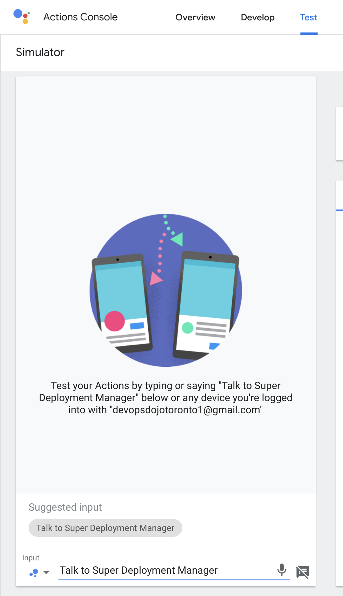

Type in the following: *Ask Super Deployment Manager for an environment*. You should see the follow response: *Okay. Getting the test version of Super Deployment Manager.Ok. I can deploy a few things, but I will tell you all about it soon.*

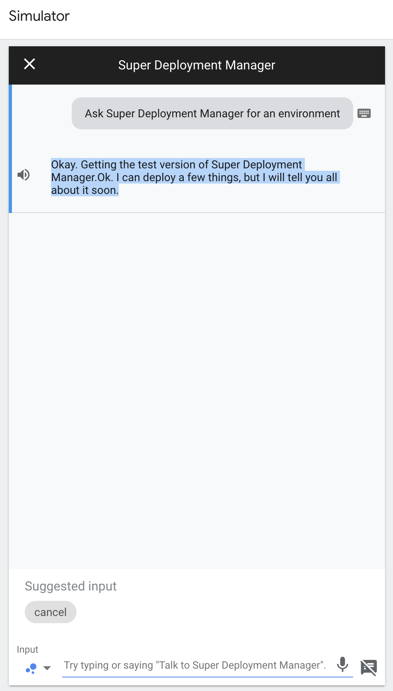

As you might have noticed, the Google Assistant first say it's getting the test version of Super Deployment Manager. Then, it says whatever we specified in the `conv.ask()` function call in the Node.js function (remember the Inline Editor?). 

Well done if you've made it till here! Take a quick break and grab a coffee because things will get more interesting now!

# Working with Follow-Up Intents

Before we configure a follow-up intent, let's understand why we need it in the first place. The way we're configuring our Action, the conversation would be something like:

* (1) User: **Hey Google, ask Super Deployment Manager for an environment**
* (2) Agent: *Ok, what kind of environment would like? I can deploy A, B and C*
* (3) User: **I'd like A and B**
* (4) Agent: *No problem, I just deployed A and B as you requested.*

When the user starts the conversation (1), the Agent matches the user's sentence to an Intent and replies. However, instead of making that response the end of the conversation, the Agent wants to know more information (2). When the user provides more details (3), the Agent matches that information to a **follow-up** intent (4). Follow-up intents are basically a continuation of the first intent matched. Let's go back to the DialogFlow console to see how this works.

Click on **Intent** again. You will notice that if you hover the cursor over the **Deploy** intent, a **Add follow-up intent** button will show up on the right-hand side:


If you click on it, you will be given a few options. Click on **custom**. Now, you will see that the follow-up intent (named **Deploy - custom**) is underneath the **Deploy** intent:


What we're basically going to do is: for each kind of environment that we want the agent to deploy, we'll create a follow-up intent. First, let's create a follow-up intent to deploy a Kubernetes cluster on GCP using GKE. 

Click on **Deploy - custom** and do the following:

1. Rename **Deploy - custom** to **Kubernetes**
2. In the Training Phrases section, enter many phrases that ask for a Kubernetes cluster
3. Enable fulfillment

Before you save this intent, there is one more thing you should configure. Whenever you launch a Kubernetes cluster, you need to know the number of nodes that should be deployed with the cluster. In this case, **number of nodes** is a **parameter** the user will pass to the intent. To set up a parameter is very easy. Type in a sentence in *Training phrases* which includes a number. For example, *I want a Kubernetes cluster with 2 nodes*. DialogFlow will notice a number should be part of the sentence and will add a parameter of type @sys.number (an integer):

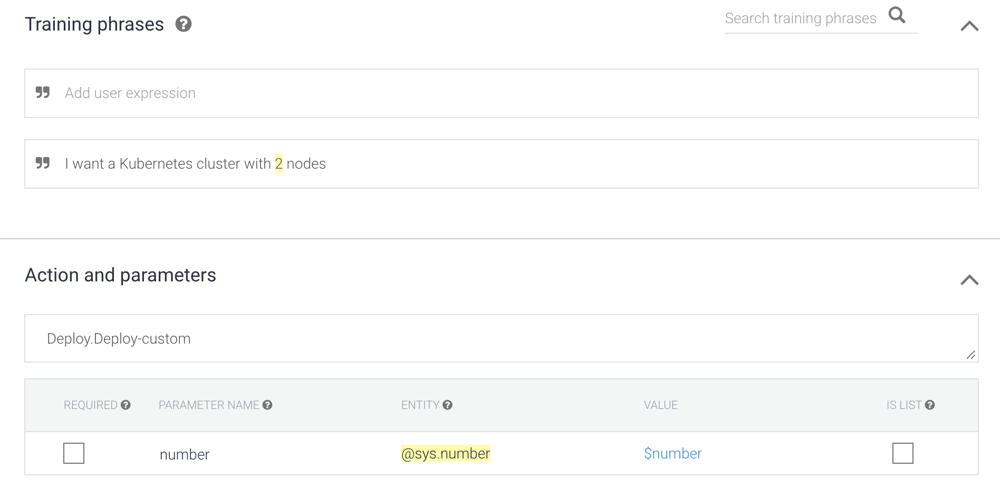

Call the parameter **nodeCount** (instead of *number*) and make it mandatory. Also, define some Prompts. [Learn more Actions and Parameters](https://cloud.google.com/dialogflow/docs/intents-actions-parameters#prompts). 
In regards to responses, you do not need to specify one as it will come from the Webhook.

Save the intent when you are done.

# Handling the Kubernetes follow-up intent

Now that we have a new intent, we need to add a function to handle when that intent is matched. Go back to fulfillment and the Inline Editor. Here's what you need to do:

1. Create a handler for the Kubernetes follow-up intent.
2. Make a request to the URL of your Cloud Run service and specify the following URI: /templates/gke?node_count=<NODE_COUNT> where <NODE_COUNT> is the number of nodes that the user requested. If the request is successful, tell the user a Kubernetes cluster with <NODE_COUNT> nodes is being deployed. If the request fails, return an error message to the user.

Suggestion 1: use the `request` library (version 2.88.0) to make the HTTP call.

Suggestion 2: wrap your request in a Promise object (ask one of the Javascript ninjas in your team).

Suggestion 3: if something errors out, click on the **View execution logs in the Firebase console** link:

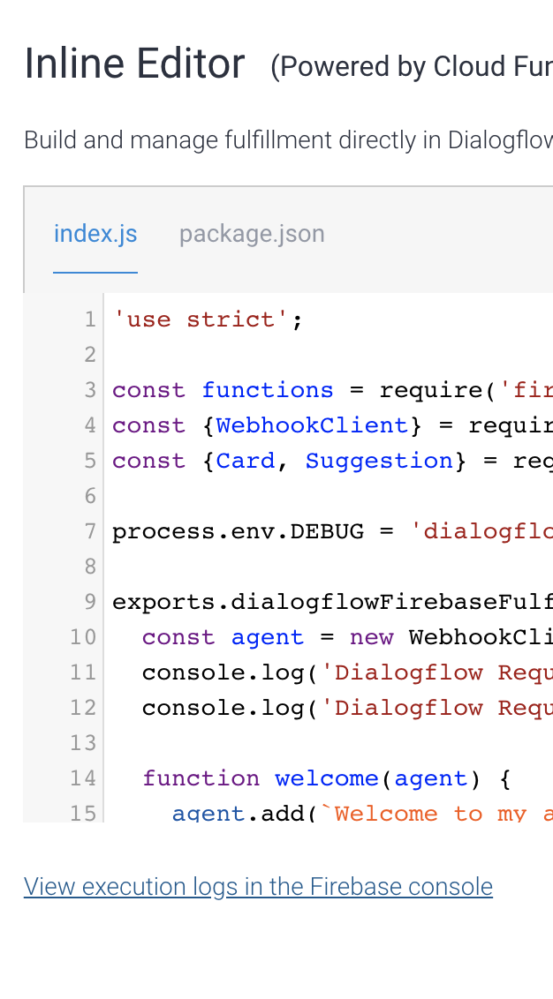

If the request is successful, go back to your GCP console and open the menu on the left. Look for **Kubernetes Engine** and click on it. Check if a Kubernetes cluster is being launched!

# Creating Entities

Our follow-up intent is quite simple. You ask for a Kubernetes cluster with a certain number of nodes and it deploys it. But what if we wanted to deploy this cluster to multiple environments or deploy a database with it? In that case, we'll need entities!

Go to the Entities page. Here's what you need to do:

* Create 2 entities: Database and Environment
* For the Database entity, create 2 entries. Use the reference value `a database` for when the user requests a database and `no database` for when the user does not request a database. It is extremely important to use `a database` and `no database` as reference values because that's what the deployment manager script running on Cloud Run will check. Then, enter synonyms for each one of these reference values.
* For the Environment entity, create 3 entries. Use the reference values `development`, `staging` and `production`. Create synonyms accordingly.

Once you create these 2 entities, go back to the follow-up intent and add a few user expressions which use some of the values of the entities. For example, a good user expression to add would be: *I would like a Kubernetes cluster with 2 nodes and a database in production*. This sentence contains 3 parameters: **the number of Nodes** (of type `@sys.number`), **the database** request (of type `@Database`) and **the environment** to which the cluster should be deployed (of type `@Environment`). To make the conversation flow more natually, add prompts for each parameter.

Finally, you will have to adjust your webhook function to handle this new user request. Add two more parameters to the Cloud Run Service URI: `env` and `database`. The complete URL should look like the following: `/templates/gke?node_count=<NODE_COUNT>&env=<ENVIRONMENT>&database=<DATABASE>` where `<ENVIRONMENT>` should be one of the following: `development`, `staging` or `production` and `<DATABASE>` should be either `a database` or `no database`.

Once you're done with your solution, you should be able to say to your Google Assistant: "Hey Google, I want a Kubernetes cluster with 2 nodes and a database in the production environment" and you should see a GKE cluster with 2 nodes and a SQL database being launched (resources should be prefixed with `prod` in this case).  

Good luck and don't hesitate to contact the organizers of the event in case you have any questions!

PS: Don't forget to delete all resources when you're done! To make your life easier, go to the **Deployment Manager** console in GCP and delete both the `gke` and the `db` deployments.

